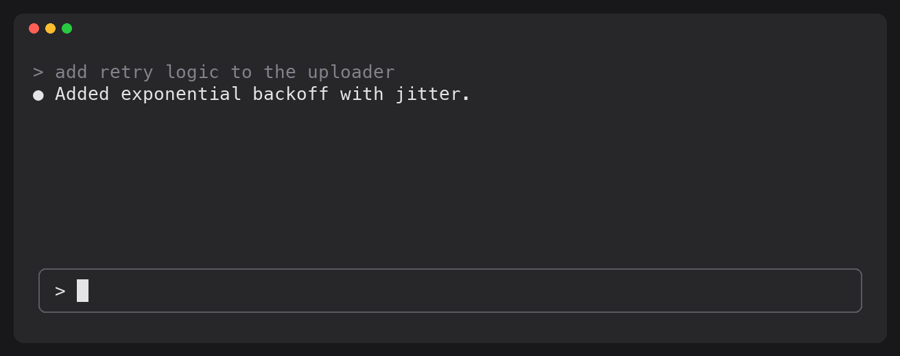

# flex

Stretch breaks for people who live in Claude Code.

Every 10 minutes Claude's mascot shows up above your prompt and acts out a
stretch: neck rolls, shoulder shrugs, a walk around the room. Every 10th prompt
it's **pinky time**: your pinky has hit Enter more times today than you've
stood up, and it deserves a moment too.



## Install

flex lives in the [Artisanal AI marketplace](https://github.com/artisanal-ai/claude-plugins).
Inside Claude Code:

```
/plugin marketplace add artisanal-ai/claude-plugins
/plugin install flex@artisanal-ai
```

Breaks start with your next session. 

To update later:
```
/plugin marketplace update artisanal-ai
```

To remove it:
```
/plugin uninstall flex@artisanal-ai
```

## Use

Breaks come on their own. When one shows:

| Key | Does |
| --- | --- |
| `1` | **Done**: closes the break |
| `2` | **Snooze**: hides it and brings the same one back later |

The digits work while the prompt is empty, so typing a number into a real
prompt still types it. You can also click the buttons, or press `ctrl+x` `tab`
to focus the break and use `tab` / arrows and `enter`.

### Commands

| Command | Does |
| --- | --- |
| `/flex` | A break right now (and turns breaks back on if they were off) |
| `/flex pinky` | Pinky time right now |
| `/flex off` | Stops the timed breaks |
| `/flex on` | Starts them again |
| `/flex status` | Whether breaks are on, and how many prompts until pinky time |

Only prompts you type count toward pinky time; slash commands don't.

## Settings

Open `/config` and find the **flex** rows:

| Setting | Default |
| --- | --- |
| Minutes between flex breaks | 10 |
| Prompts between pinky flexes | 10 |
| Snooze minutes | 5 |

A change applies right away. The values are kept in `settings.json` under
`pluginConfigs.flex.options` (`breakMinutes`, `pinkyEveryPrompts`,
`snoozeMinutes`), so you can set them there too.

## The exercises

**Body**, one per break, in turn: neck roll, shoulder shrugs, wrist flex, chest
opener, seated twist, overhead reach, eye break, stand up, upper back stretch,
ankle circles.

**Pinky time**, in turn: pinky circles, finger stretch.

Each shows three short steps and how long it takes; the mascot acts it out
beside them.

## Make it yours

Run your own copy without installing it:

```sh
git clone https://github.com/artisanal-ai/flex.git
claude --plugin-dir ./flex
```

- `hooks/exercises.ts`: each exercise's name, length and three steps.
- `hooks/mascot.ts`: the drawings. Each exercise lists its poses drawn exactly
  as they show on screen, and an `order` of pose indices to play (repeat an
  index to hold a pose). Start each drawing at column 0: spaces on the left are
  part of the picture.
- `hooks/register.tsx`: the timers, the `/flex` command and the break above the
  prompt.

A new exercise needs an entry in `exercises.ts`. One without a drawing in
`mascot.ts` shows the mascot standing and blinking.
